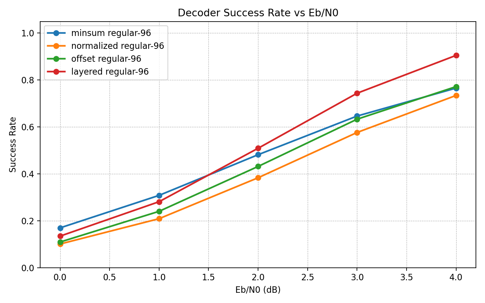
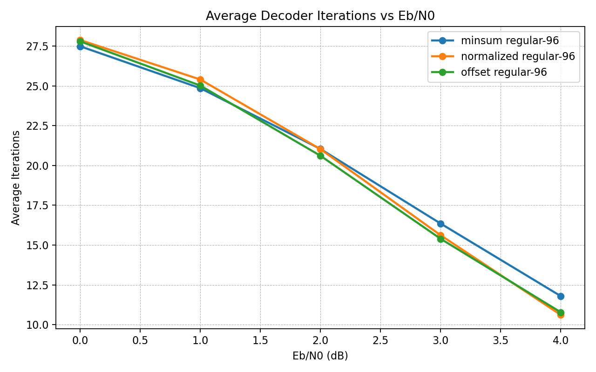
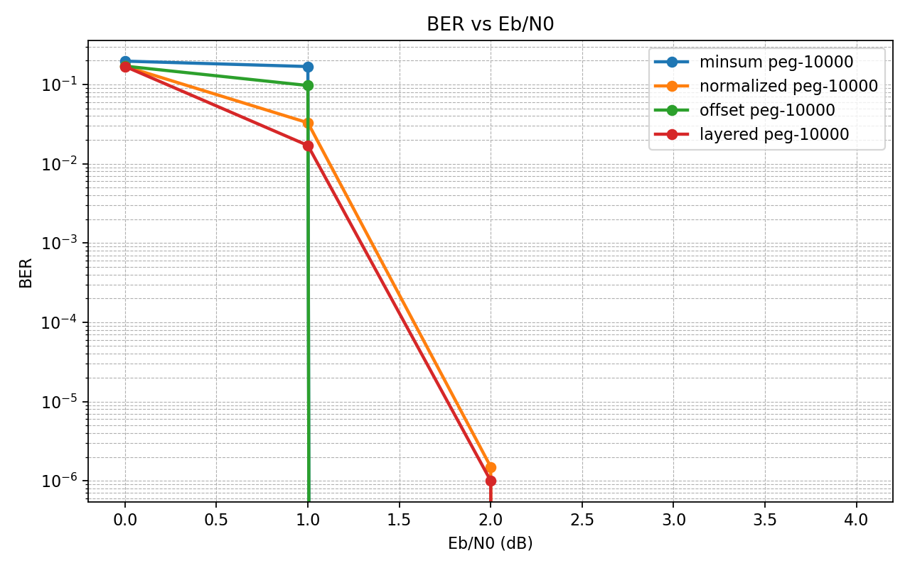
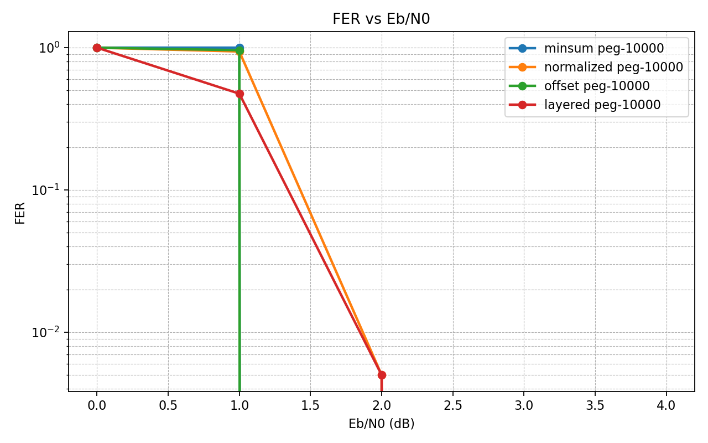
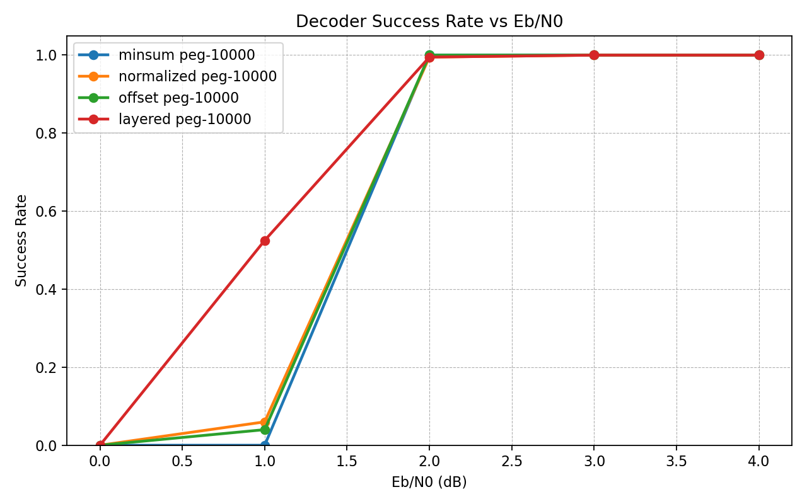
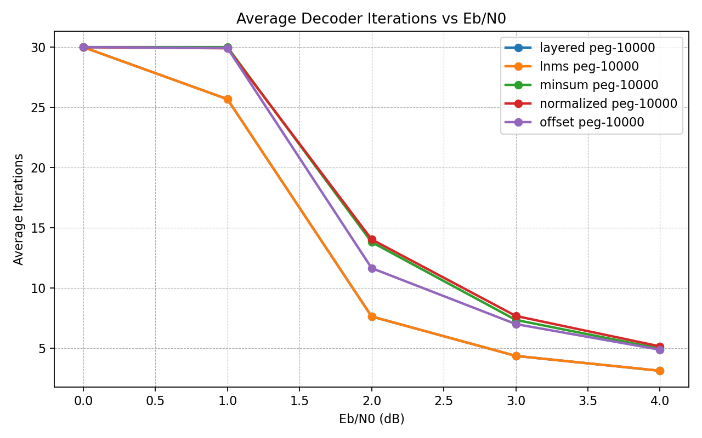

# Java LDPC Decoder


The present repo implements an experimental framework for Low-Density Parity-Check (LDPC) codes in Java. It includes multiple belief-propagation decoder variants, sparse Tanner graph representations, Monte Carlo simulation tools and performance-analysis utilities for studying iterative decoding over noisy communication channels.

At its core, the decoder attempts to solve a deceptively difficult problem. This consists of the following: a message is transmitted through a noisy physical channel, with each bit being corrupted by random noise. The question is, can the original information still be reconstructed? Surprisingly, the answer is yes. 

The key insight behind LDPC codes regarding this problem is that information can be protected not by duplicating bits, but by embedding the mesage into a sparse system of probabilistic constrains. These constraints are represented by a parity-check matrix, which can be in turn be interpreted as a bipartite graph known as Tanner graph. In this graph, variable nodes represent transmitted bits, while check nodes represent parity relations that those bits must satisfy.

Decoding then becomes an iterative inference problem. Rather than directly guessing the original message, the decoder propagates probabilitistic beliefs through the graph. Each variable node communicates its current confidence about the value of a bit to neighboring check nodes, while each check node replies with information about whether the surrounding configuration appears statistically consistent. Over successive iterations, local uncertainty is gradually reduced until the graph converges toward a globally coherent interpretation of the transmitted codeword.


Thanks to this, LDPC codes allow communication systems to operate astonishingly close to the Shannon Limit (that is, the theoretical maximum rate at which reliable communication is possible). 

Below, we describe the features from this implementation, and point to a roadmap of future features to be added.

---

# Features

## Implemented

- CSR sparse parity-check matrix representation 
- Tanner graph traversal
- Min-Sum LDPC decoder
- Normalized Min-Sum LDPC decoder
- Offset Min-Sum decoding
- Syndrome validation
- BPSK modulation
- AWGN channel simulation
- LLR initialization
- Monte Carlo BER simulation
- BER/FER visualization pipeline
- Decoder convergence statistics
- Success-rate analysis
- Alpha search for Normalized Min-Sum tuning
- Alpha sweep visualization
- Runtime matrix selection
- Regular LDPC matrix generation
- 48×96 regular LDPC experiments
- Decoder comparison framework
- JUnit test suite
- Layered decoding

## Planned

- 5G NR LDPC matrices
- DVB-S2 matrices
- SIMD and Vector API acceleration
- JMH benchmarking
- Parallel Monte Carlo simulation

---

# Mathematical Background

LDPC codes are linear block codes defined by sparse parity-check matrices:

```text
H * x = 0 mod 2
```

where `H` is a sparse binary parity-check matrix and `x` is the transmitted codeword. A valid codeword satisfies all parity constrains simultaneously.

Unlike dense algebraic codes, LDPC codes derive their power from sparsity. The parity-check matrix can be interpreted as a sparse bipartite graph known as Tanner graph, where variable nodes represent transmitted bits, check nodes represent parity constraints and edges encode which bits participate in which constraints. Through this intepretation, decoding becomes a probabilistic inference problem.

## Belief Propagation in Tanner Graphs

When a codeword is transmitted through a noisy communication channel, each received symbol becomes uncertain. Rather than directly attempting to do a guess over the original message, the decoder iteratively propagates probabilistic beliefs across the Tanner graph. Each node exchanges local statistical information with its neighbors: variable nodes communicate their confidence about bit values, check nodes enforce parity consistency and the iterative message passing gradually reduces uncertainty. 

Over successive iterations, the graph converges toward a globally consistent interpretation of the transmitted message. This process is fundamentally distributed probabilistic inference, but performed over a sparse graph model.

## Log-Likelihood Ratios (LLRs)

The decoder operates in the Log-Likelihood Ratio (LLR) domain. That is, for a received symbol `y`, the LLR is defined as:

```text
LLR(y) = log(P(bit = 0 | y) / P(bit = 1 | y))
``` 

The interpretation of this quantity is the following: a positive LLR indicates that the bit at issue is likely 0, a negative LLR hints that the bit is likely 1, and if the magnitude is large, the model has high confidence, while otherwise expresses uncertainty about the guess.

Also, operating in the logarithmic domain improves numerical stability and transforms expensive probability multiplications into efficient additions.

## Normalized Min-Sum

The current implementation uses as decoder algorithm the Normalized Min-Sum approximation of the Sum-Product Algorithm. The decoder iteratively exchanges two types of messages:

### Variable-to-Check Messages

Each variable node sends its current belief to neighboring check nodes:

```text
q(v -> c) = Lch(v) + Σ r(c' -> v)
```

where `Lch(v)` is the channel LLR and `r(c' -> v)` are incoming check-node messages. This way we represent the current confidence associated with a bit after incorporating neighboring constraints.

### Check-to-Variable Messages

Each check node computes parity-consistent feedback:

```text
r(c -> v) = α × sign(Π q(v' -> c)) × min(|q(v' -> c)|)
```

where `sign(...)` determines parity consistency, `min(...)` approximates confidence propagation and `α` is a normalization factor.

### Posterior Belief 

The final posterior LLR for each variable node is computed as 

```text
L(v) = Lch(v) + Σ r(c -> v) 
```

Besides, the decoded bit estimate is obtained through a hard decision rule:

```text 
bit = (L < 0) ? 1 : 0
```

The resulting codeword is then validated against the parity constrains:

```text
H · x = 0 mod 2
```

Then, if all constraints are satisfied, decoding terminates successfully.

## Layered Decoding

The classical implementation of Belief Propagation uses a flooding schedule. During iteration \(t\), all check-node messages are computed before any variable-node beliefs are updated.

For the Normalized Min-Sum approximation, the check-node update is

```text
r(c -> v)^t =
    alpha
    * sign( product q(v' -> c)^(t-1) )
    * min |q(v' -> c)^(t-1)|

for all v' in N(c) \ {v}
```

where `N(c)` is the set of variable nodes connected to check node `c`. The posterior belief of variable `v` is then computed as: 

```text
L_v^t =
    L_ch(v)
    + sum r(c -> v)^t

for all c in N(v)
```

In the flooding schedule, the newly computed messages are not used until the next decoding iteration. Layered decoding modifies this procedure by processing the parity-check matrix one layer at a time. After computing a new check-node message, the corresponding posterior belief is updated immediately:

```text
L_v =
    L_v
    - r_old(c -> v)
    + r_new(c -> v)
```

This update removes the stale contribution from the previous iteration and replaces it with the newly computed message. As a consequence, information propagates through the Tanner graph more rapidly, allowing subsequent layers to operate on fresher beliefs within the same iteration.

Empirically, this often leads to both faster convergence and improved decoding performance. In experiments on a regular (48,96) LDPC code, Layered Min-Sum reduced the average number of decoding iterations from approximately (11) to (4), while simultaneously achieving the best BER and FER performance among the implemented decoder variants.

## AWGN Channel Model

The communication channel is modeled using an Additive White Gaussian Noise (or AWGN) process:

```text
y = x + n
```

where `x` is the transmited BPSK-modulated symbol and `n ~ N(0, σ²) is Gaussian noise. This makes possible to simulate thermal noise and physical signal corruption encountered in real communication systems.

## Monte Carlo BER Simulation

Decoder performance is evaluated statistically using Monte Carlo simulation.

For each Eb/N' operating points:

1. Generate codewords
2. Modulate using BPSK
3. Inject Gaussian noise
4. Decode iteratively
5. Measure bit and frame errors
6. Repeat thousands of times.

This produces empiral BER (Bit Error Rate) and FER (Frame Error Rate) curves that characterize decoder reliability under noisy conditions.

Output:

```text
Eb/N0, BER, FER
```

Example:

```text
Eb/N0 0.0 dB | BER 1.2e-1 | FER 4.8e-1
Eb/N0 1.0 dB | BER 4.1e-2 | FER 2.2e-1
Eb/N0 2.0 dB | BER 8.0e-3 | FER 5.0e-2
```

---

# Repository Structure

```text
src/
├── main/
│   ├── java/ldpc/
│   │   ├── app/
│   │   ├── channel/
│   │   ├── decoder/
│   │   ├── matrix/
│   │   ├── simulation/
│   │   └── util/
│   │
│   └── resources/
│       └── matrices/
│
└── test/
    ├── java/
    └── resources/

tools/
└── plot_ber.py

results/
├── ber/
└── figures/
```

# Simulation Workflow

The simulator evaluates LDPC decoder performance by transmitting codewords through a noisy communication channel and attempting to reconstruct them using iterative belief propagation.

```text
All-Zero Codeword
        │
        ▼
 BPSK Modulation
        │
        ▼
   AWGN Channel
        │
        ▼
 Received Symbols
        │
        ▼
 LLR Initialization
        │
        ▼
  LDPC Decoder
        │
        ├─ Min-Sum
        ├─ Normalized Min-Sum
        ├─ Offset Min-Sum
        └─ Layered Min-Sum
        │
        ▼
 Decoded Codeword
        │
        ▼
 Syndrome Check
        │
        ▼
 BER / FER Statistics
        │
        ▼
 Performance Curves
```


---

# Getting Started

## Requirements

Requirements:

### Java

- Java 17
- Maven 3+

### Python 

- Python 3.12
- matplotlib 3.10

Create and activate the environment with:

```bash
micromamba env create -f environment.yml
micromambda activate ldpc-decoder 
```

## Build 

Compile the project with

```bash 
mvn clean compile 
```

Then it's possible to run the test suite with:

```bash
mvn test
```

## Running BER Simulations

### Min-Sum Decoder

```bash
mvn exec:java \ 
	-Dexec.mainClass="ldpc.app.BerRunner" \ 
	-Dexec.args="minsum"
```

Expected output:

```bash 
results/ber/ber_minsum.csv
```

### Normalized Min-Sum Decoder

```bash
mvn exec:java \
	-Dexec.mainClass="ldpc.app.BerRunner" \
	-Dexec.args="normalized"
```

Expected output:

```bash
results/ber/ber_normalized.csv
```

Each simulation generates BER (Bit Error Rate) and FER (Frame Error Rate) measurements over a range of Eb/N0 operating points.

## Generating BER and FER plots

Once simulation results have been generated, create performance plots with 

```python
python3 tools/plot_ber.py \
	results/ber/ber_minsum.csv \
	results/bet/ber_normalized.csv 
```

Expected output:

```bash 
results/figures/ber_curve.png
results/figures/fer_curve.png
```

## Alpha Search Experiments

The repository includes an automated alpha search utility for Normalized Min-Sum decoding. You can use it running:

```bash
mvn exec:java \
	-Dexec.mainClass="ldpc.app.AlphaSearchRunner"
```

This evaluates multiple normalization factors and generates BER and FER measurements for each configuration. To visualize the sweep it's possible to use:

```bash
python3 tools/plot_alpha_sweep.py
```

## Example Worflow 

```bash 
mvn exec:java -Dexec.mainClass="ldpc.app.BerRunner" -Dexec.args="minsum"

mvn exec:java -Dexec.mainClass="ldpc.app.BerRunner" -Dexec.args="normalized"

mvn exec:java -Dexec.mainClass="ldpc.app.AlphaSearchRunner"

python3 tools/plot_ber.py results/ber/ber_minsum.csv results/ber/ber_normalized.csv

python3 tools/plot_alpha_sweep.py
```

# Example Results

### BER Performance


### FER Performance


### Success Rate of Decoders


### Average Iterations Curve


# Experimental Setup

Unless otherwise noted:

- Code: Regular (48,96) LDPC
- Rate: 1/2
- Channel: AWGN
- Modulation: BPSK
- Trials: 10,000 per Eb/N0 point
- Maximum iterations: 30

# Decoder Comparison (48x96 Regular LDPC)


| Decoder | BER @ 4 dB | FER @ 4 dB | AvgIter |
|----------|----------:|----------:|----------:|
| Min-Sum | 1.89e-2 | 5.89e-1 | 11.80 |
| Normalized Min-Sum | 1.64e-2 | 5.72e-1 | 10.62 |
| Offset Min-Sum | 1.67e-2 | 5.76e-1 | 10.79 |
| Layered Min-Sum | 1.46e-2 | 5.05e-1 | 4.29 |

# PEG LDPC Code Results

The repository includes as well experiments on a PEG LDPC parity-check matrix in AList format. In order to obtain this resource, we have followed both the documentation on GHG.p written by David MacKay and the already-prepared LDPC codes from the Research Group on Quantum Information and Computation from the Technical University of Madrid (both sources can be found in the [references section](#references)).


## Matrix Characteristics

| Property               | Value                         |
| ---------------------- | ----------------------------- |
| Construction           | Progressive Edge Growth (PEG) |
| Format                 | AList                         |
| Columns (N)            | 10000                         |
| Rows (M)               | 5000                          |
| Code Rate              | 0.5                           |
| Edges                  | 40083                         |
| Channel                | AWGN                          |
| Maximum Iterations     | 30                            |
| Trials per Eb/N0 Point | 200                           |

This matrix is significantly larger than the toy and synthetic benchmark matrices used elsewhere in the repository and better reflects the behavior of practical LDPC codes.

## Decoder Comparison

Four decoding algorithms were evaluated:

* Min-Sum
* Normalized Min-Sum
* Offset Min-Sum
* Layered Min-Sum

### BER Performance

The Bit Error Rate (BER) results reveal a clear waterfall region between approximately 1 dB and 2 dB. Layered Min-Sum enters the waterfall region earlier than the flooding-schedule variants and achieves the lowest BER at low signal-to-noise ratios.



### FER Performance

The Frame Error Rate (FER) results show the same trend. At 1 dB, Layered Min-Sum successfully decodes more than half of all frames, while the other variants still experience very high frame error rates.



### Decoder Success Rate

The decoder success rate highlights the transition from unreliable decoding to near-perfect decoding.

Layered Min-Sum achieves:

| Eb/N0 (dB) | Success Rate |
| ---------: | -----------: |
|          0 |        0.000 |
|          1 |        0.525 |
|          2 |        0.995 |
|          3 |        1.000 |
|          4 |        1.000 |



### Average Iterations

Layered Min-Sum requires substantially fewer decoding iterations than the flooding-schedule variants.

At 2 dB:

| Decoder            | Average Iterations |
| ------------------ | -----------------: |
| Min-Sum            |               13.8 |
| Normalized Min-Sum |               14.1 |
| Offset Min-Sum     |               11.7 |
| Layered Min-Sum    |                7.6 |

This reduction in iteration count is one of the primary reasons layered schedules are widely used in practical LDPC decoders.



## Layered Min-Sum Results

| Eb/N0 (dB) |         BER |   FER | Success Rate | Avg. Iterations |
| ---------: | ----------: | ----: | -----------: | --------------: |
|          0 | 1.684965e-1 | 1.000 |        0.000 |           30.00 |
|          1 | 1.698850e-2 | 0.475 |        0.525 |           25.68 |
|          2 | 1.000000e-6 | 0.005 |        0.995 |            7.62 |
|          3 |  0.000000e0 | 0.000 |        1.000 |            4.34 |
|          4 |  0.000000e0 | 0.000 |        1.000 |            3.11 |

## Discussion

The PEG matrix exhibits the characteristic LDPC waterfall phenomenon. Decoding performance is poor at very low signal-to-noise ratios, improves rapidly around 1–2 dB, and becomes effectively error-free in this simulation above 3 dB.

Among all evaluated algorithms, Layered Min-Sum provides the best overall trade-off between decoding performance and computational cost. It achieves higher success rates at low Eb/N0 values while simultaneously requiring fewer iterations to converge.

# Demos

## Text Transmission Demo

The repository includes [end-to-end file transmission examples](demo/messages) using public-domain texts. Among the current available demos, it's possible to find *The Bostonians*, by Henry James (both volumes), and *Moby-Dick*, by Herman Melville (both highly recommended beyond their role in this demo!). At the same time, there is a smoke-test text available, which is a quote from *Solaris*, by Stanislav Lem.

Files are converted to bits, encoded with an LDPC code, transmitted through a simulated AWGN channel, decoded and reconstructed. The recovered files can then be compared byte-for-byte with the originals.

### Example

```bash
mvn compile exec:java \
  -Dexec.mainClass="ldpc.app.FileTransmissionDemo" \
  -Dexec.args="demo/messages/moby_dick.txt results/transmission/recovered_moby_dick.txt lnms peg-10000 0.25"
```

Expected output:

```text
Frames: ...
Failed frames: 0
Bit errors: 0
BER: 0.000000000000
Byte-perfect recovery: true
```

Verify the reconstruction:

```bash
diff demo/messages/moby_dick.txt \
     results/transmission/recovered_moby_dick.txt
```

A successful transmission produces no output from `diff`, indicating that the recovered file is byte-for-byte identical to the original.

## Audio Transmission Demo

TBA

## Image Transmission Demo

The repository supports transmission of arbitrary binary files. Since images are stored as sequences of bytes, they can be transmitted through the same LDPC communication pipeline. 

A public-domain photograph of a Highland cow is included as an example transmission artifact.

The experiment can be conduced the following way:

```bash
mvn compile exec:java \
	-Dexec.mainClass="ldpc.app.FileTransmissiondemo" \
	-Dexec.args="demo/images/highland_cow.jpg results/
```

The expected results are

```text
Failed frames: 0
Bit errors: 0
BER: 0.000000000000
Byte-perfect recovery: true
```

---

# References

- Gallager, R. G (1962). *Low-Density Parity-Check Codes*. In *IRE Transactions on Information Theory*, Volume 8, Issue 1.
- MacKay, D. J. C. (2003).  *Information Theory, Inference, and Learning Algorithms* Cambridge University Press. 
- Richardson, T. & Urbanke, R. (2008). *Modern Coding Theory*. Cambridge University Press.
- MacKay, D. J. C (2006). *AList Matrix Format Documentation*. https://www.inference.org.uk/mackay/codes/alist.html
- Codification and Cryptography Group (GCC), Polytechnique University of Madrid (2016). *LDPC Codes and Matrices Database*. http://www.gcc.fi.upm.es/en/codes.html

---

# License

MIT
