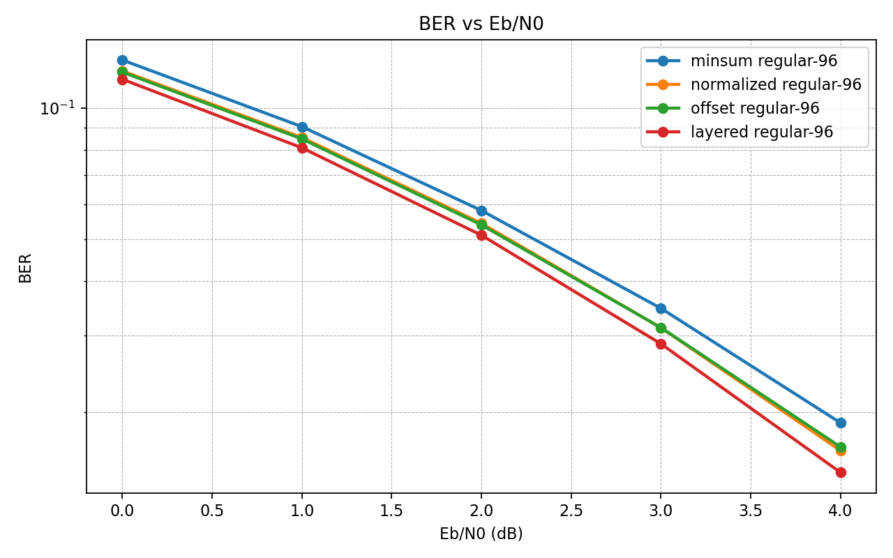
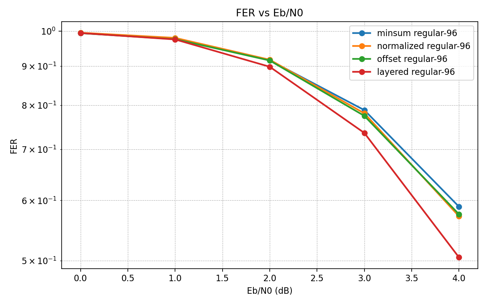

# Java LDPC Decoder


The present repo implements a LDPC (Low-Density Parity-Check) decoder implementation in Java using iterative Belief Propagation algorithms over sparse Tanner graphs.

At its core, the decoder attempts to solve a deceptively difficult problem. This consists of the following: a message is transmitted through a noisy physical channel, with each bit being corrupted by random noise. The question is, can the original information still be reconstructed? Surprisingly, the answer is yes. 

The key insight behind LDPC codes regarding this problem is that information can be protected not by duplicating bits, but by embedding the mesage into a sparse system of probabilistic constrains. These constraints are represented by a parity-check matrix, which can be in turn be interpreted as a bipartite graph known as Tanner graph. In this graph, variable nodes represent transmitted bits, while check nodes represent parity relations that those bits must satisfy.

Decoding then becomes an iterative inference problem. Rather than directly guessing the original message, the decoder propagates probabilitistic beliefs through the graph. Each variable node communicates its current confidence about the value of a bit to neighboring check nodes, while each check node replies with information about whether the surrounding configuration appears statistically consistent. Over successive iterations, local uncertainty is gradually reduced until the graph converges toward a globally coherent interpretation of the transmitted codeword.


Thanks to this, LDPC codes allow communication systems to operate astonishingly close to the Shannon Limit (that is, the theoretical maximum rate at which reliable communication is possible). 

Below, we describe the features from this implementation, and point to a roadmap of future features to be added.

---

# Features

## Implemented

- CSR sparse parity-check matrix representation 
- Tanner graph traversal
- Min-Sum LDPC decoder
- Normalized Min-Sum LDPC decoder
- Offset Min-Sum decoding
- Syndrome validation
- BPSK modulation
- AWGN channel simulation
- LLR initialization
- Monte Carlo BER simulation
- BER/FER visualization pipeline
- Alpha search for Normalized Min-Sum tuning
- Alpha sweep visualization
- Runtime matrix selection
- Regular LDPC generation
- JUnit test suite

## Planned

- Layered decoding
- Larger parity-check matrices
- 5G NR LDPC matrices
- DVB-S2 matrices
- SIMD and Vector API acceleration
- JMH benchmarking
- Parallel Monte Carlo simulation
- Decoder convergence analysis

# Mathematical Background

LDPC codes are linear block codes defined by sparse parity-check matrices:

```text
H * x = 0 mod 2
```

where `H` is a sparse binary parity-check matrix and `x` is the transmitted codeword. A valid codeword satisfies all parity constrains simultaneously.

Unlike dense algebraic codes, LDPC codes derive their power from sparsity. The parity-check matrix can be interpreted as a sparse bipartite graph known as Tanner graph, where variable nodes represent transmitted bits, check nodes represent parity constraints and edges encode which bits participate in which constraints. Through this intepretation, decoding becomes a probabilistic inference problem.

## Belief Propagation in Tanner Graphs

When a codeword is transmitted through a noisy communication channel, each received symbol becomes uncertain. Rather than directly attempting to do a guess over the original message, the decoder iteratively propagates probabilistic beliefs across the Tanner graph. Each node exchanges local statistical information with its neighbors: variable nodes communicate their confidence about bit values, check nodes enforce parity consistency and the iterative message passing gradually reduces uncertainty. 

Over successive iterations, the graph converges toward a globally consistent interpretation of the transmitted message. This process is fundamentally distributed probabilistic inference, but performed over a sparse graph model.

## Log-Likelihood Ratios (LLRs)

The decoder operates in the Log-Likelihood Ratio (LLR) domain. That is, for a received symbol `y`, the LLR is defined as:

```text
LLR(y) = log(P(bit = 0 | y) / P(bit = 1 | y))
``` 

The interpretation of this quantity is the following: a positive LLR indicates that the bit at issue is likely 0, a negative LLR hints that the bit is likely 1, and if the magnitude is large, the model has high confidence, while otherwise expresses uncertainty about the guess.

Also, operating in the logarithmic domain improves numerical stability and transforms expensive probability multiplications into efficient additions.

## Normalized Min-Sum

The current implementation uses as decoder algorithm the Normalized Min-Sum approximation of the Sum-Product Algorithm. The decoder iteratively exchanges two types of messages:

### Variable-to-Check Messages

Each variable node sends its current belief to neighboring check nodes:

```text
q(v -> c) = Lch(v) + Σ r(c' -> v)
```

where `Lch(v)` is the channel LLR and `r(c' -> v)` are incoming check-node messages. This way we represent the current confidence associated with a bit after incorporating neighboring constraints.

### Check-to-Variable Messages

Each check node computes parity-consistent feedback:

```text
r(c -> v) = α × sign(Π q(v' -> c)) × min(|q(v' -> c)|)
```

where `sign(...)` determines parity consistency, `min(...)` approximates confidence propagation and `α` is a normalization factor.

### Posterior Belief 

The final posterior LLR for each variable node is computed as 

```text
L(v) = Lch(v) + Σ r(c -> v) 
```

Besides, the decoded bit estimate is obtained through a hard decision rule:

```text 
bit = (L < 0) ? 1 : 0
```

The resulting codeword is then validated against the parity constrains:

```text
H · x = 0 mod 2
```

Then, if all constraints are satisfied, decoding terminates successfully.

## AWGN Channel Model

The communication channel is modeled using an Additive White Gaussian Noise (or AWGN) process:

```text
y = x + n
```

where `x` is the transmited BPSK-modulated symbol and `n ~ N(0, σ²) is Gaussian noise. This makes possible to simulate thermal noise and physical signal corruption encountered in real communication systems.

## Monte Carlo BER Simulation

Decoder performance is evaluated statistically using Monte Carlo simulation.

For each Eb/N' operating points:

1. Generate codewords
2. Modulate using BPSK
3. Inject Gaussian noise
4. Decode iteratively
5. Measure bit and frame errors
6. Repeat thousands of times.

This produces empiral BER (Bit Error Rate) and FER (Frame Error Rate) curves that characterize decoder reliability under noisy conditions.

Output:

```text
Eb/N0, BER, FER
```

Example:

```text
Eb/N0 0.0 dB | BER 1.2e-1 | FER 4.8e-1
Eb/N0 1.0 dB | BER 4.1e-2 | FER 2.2e-1
Eb/N0 2.0 dB | BER 8.0e-3 | FER 5.0e-2
```

---

# Repository Structure

```text
src/
├── main/
│   ├── java/ldpc/
│   │   ├── app/
│   │   ├── channel/
│   │   ├── decoder/
│   │   ├── matrix/
│   │   ├── simulation/
│   │   └── util/
│   │
│   └── resources/
│       └── matrices/
│
└── test/
    ├── java/
    └── resources/

tools/
└── plot_ber.py

results/
├── ber/
└── figures/
```


---

# Getting Started

## Requirements

Requirements:

### Java

- Java 17
- Maven 3+

### Python 

- Python 3.12
- matplotlib 3.10

Create and activate the environment with:

```bash
micromamba env create -f environment.yml
micromambda activate ldpc-decoder 
```

## Build 

Compile the project with

```bash 
mvn clean compile 
```

Then it's possible to run the test suite with:

```bash
mvn test
```

## Running BER Simulations

### Min-Sum Decoder

```bash
mvn exec:java \ 
	-Dexec.mainClass="ldpc.app.BerRunner" \ 
	-Dexec.args="minsum"
```

Expected output:

```bash 
results/ber/ber_minsum.csv
```

### Normalized Min-Sum Decoder

```bash
mvn exec:java \
	-Dexec.mainClass="ldpc.app.BerRunner" \
	-Dexec.args="normalized"
```

Expected output:

```bash
results/ber/ber_normalized.csv
```

Each simulation generates BER (Bit Error Rate) and FER (Frame Error Rate) measurements over a range of Eb/N0 operating points.

## Generating BER and FER plots

Once simulation results have been generated, create performance plots with 

```python
python3 tools/plot_ber.py \
	results/ber/ber_minsum.csv \
	results/bet/ber_normalized.csv 
```

Expected output:

```bash 
results/figures/ber_curve.png
results/figures/fer_curve.png
```

## Alpha Search Experiments

The repository includes an automated alpha search utility for Normalized Min-Sum decoding. You can use it running:

```bash
mvn exec:java \
	-Dexec.mainClass="ldpc.app.AlphaSearchRunner"
```

This evaluates multiple normalization factors and generates BER and FER measurements for each configuration. To visualize the sweep it's possible to use:

```bash
python3 tools/plot_alpha_sweep.py
```

## Example Worflow 

```bash 
mvn exec:java -Dexec.mainClass="ldpc.app.BerRunner" -Dexec.args="minsum"

mvn exec:java -Dexec.mainClass="ldpc.app.BerRunner" -Dexec.args="normalized"

mvn exec:java -Dexec.mainClass="ldpc.app.AlphaSearchRunner"

python3 tools/plot_ber.py results/ber/ber_minsum.csv results/ber/ber_normalized.csv

python3 tools/plot_alpha_sweep.py
```

# Example Results

### BER Performance


### FER Performance


---

# References

- Gallager, R. G (1962). *Low-Density Parity-Check Codes*. In *IRE Transactions on Information Theory*, Volume 8, Issue 1.
- MacKay, D (2003).  *Information Theory, Inference, and Learning Algorithms* Cambridge University Press. 
- Richardson & Urbanke (2008). *Modern Coding Theory*. Cambridge University Press.

---

# License

MIT
